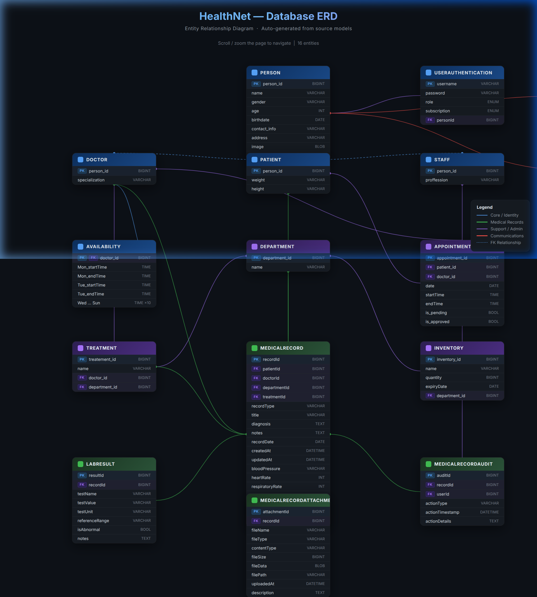

# HealthNet Backend

HealthNet is a comprehensive healthcare management backend built with Spring Boot. It provides a robust set of APIs to manage patients, doctors, medical records, appointments, and hospital inventory.

## Features

- **User Management**: Role-based authentication (Admin, Doctor, Patient, Staff) with secure login and subscription tiers.
- **Medical Records**: Comprehensive medical record tracking including vitals, diagnoses, notes, and lab results.
  - Support for attaching files to medical records.
  - Built-in audit trail for medical record actions.
- **Appointments**: Schedule and manage doctor appointments.
- **Hospital Management**: Track departments, treatments, and hospital inventory.
- **AI Chat & Feedback**: Integrated chat interface for users to interact with the system and a suggestion module for feedback.

## Tech Stack

- **Framework**: Spring Boot (Java)
- **Security**: Spring Security with JWT (JSON Web Tokens)
- **Database**: SQL Database with JDBC/Spring Data (Repositories)
- **Build Tool**: Maven

## Database Schema (ERD)

The application relies on a comprehensive relational database schema. We have generated an interactive HTML ERD diagram for easy exploration of the models.

> **Note**: An interactive, full version of the ERD is available in `erd.html`. Open it in any web browser to view the interactive diagram.

## Project Structure

- `com.server.HealthNet.Controller` - REST API endpoints
- `com.server.HealthNet.Service` - Business logic layer
- `com.server.HealthNet.Repository` - Database access and queries
- `com.server.HealthNet.Model` - Data models and entities
- `com.server.HealthNet.SecurityConfig` - Authentication and authorization logic
