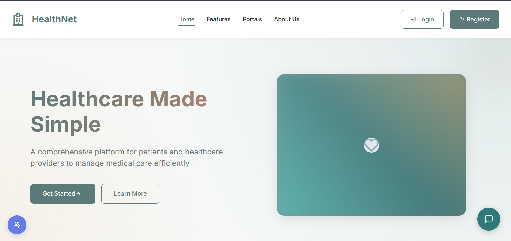
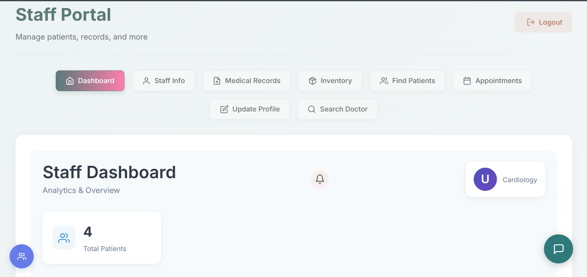

# HealthNet Backend

A Spring Boot REST API for healthcare management — patients, doctors, medical records, appointments, and hospital inventory — secured with JWT and role-based access control.

<div align="center">

### 🌐 [**Live Demo → zero-70.github.io/Healthnet-frontend**](https://zero-70.github.io/Healthnet-frontend/)

</div>

---

## 🚀 Live Deployment

| | |
|---|---|
| **This API** | [healthnet-zair-7aa588192c75.herokuapp.com](https://healthnet-zair-7aa588192c75.herokuapp.com) |
| **Frontend** | [zero-70.github.io/Healthnet-frontend](https://zero-70.github.io/Healthnet-frontend/) |
| **Frontend source** | [github.com/ZERO-70/Healthnet-frontend](https://github.com/ZERO-70/Healthnet-frontend) |
| **Full project overview** | [github.com/ZERO-70/HealthNet-FullStack](https://github.com/ZERO-70/HealthNet-FullStack) |

Running on the Heroku container stack against a managed **Aiven MySQL 8.4**
database.

### Try it

```bash
curl -X POST https://healthnet-zair-7aa588192c75.herokuapp.com/user_authentication/login \
  -H 'Content-Type: application/json' \
  -d '{"username":"admin","password":"admin123"}'
```

That returns a JWT. Pass it as `Authorization: Bearer <token>` on subsequent
requests.

| Role | Username | Password |
|---|---|---|
| Admin | `admin` | `admin123` |
| Doctor | `doctor1` | `doctor123` |
| Staff | `numan` | `numan123` |
| Patient | `patient1` | `patient123` |

---

## 📸 The API in action

<div align="center">



</div>

<details>
<summary><b>Screens powered by these endpoints</b></summary>
<br>

| Staff dashboard — aggregate queries | Inventory — `/inventory` |
|:--:|:--:|
|  |  |

| Admin management — `/doctor`, `/patient`, `/staff` |
|:--:|
|  |

</details>

---

## Features

- **User Management:** Role-based authentication (Admin, Doctor, Patient, Staff) with JWT and subscription tiers
- **Medical Records:** Vitals, diagnoses, notes, and lab results
  - File attachments stored against records
  - Built-in audit trail for record actions
- **Appointments:** Schedule and manage doctor appointments, with per-doctor weekly availability
- **Hospital Management:** Departments, treatments, and inventory tracking
- **Feedback:** User suggestion module

### AI assistant — disabled by default

`ChatService` and `SuggestionService` originally called an external AI service
that no longer exists. Both now sit behind a feature flag:

```properties
healthnet.ai.enabled=false
```

While disabled, chat endpoints return a clear "unavailable" message immediately
instead of blocking on the old 10-minute timeout, and the nightly suggestion job
is skipped entirely — that job deletes every row in `suggestion` before
refetching, so running it without a reachable AI service would wipe the table and
repopulate nothing. Set `AI_ENABLED=true` and `AI_BASE_URL` to reconnect a
replacement implementing the same contract.

---

## Tech Stack

| | |
|---|---|
| **Framework** | Spring Boot 3.3.5 (Java 17+) |
| **Security** | Spring Security with JWT (jjwt 0.12) and BCrypt |
| **Database** | MySQL 8 via Spring JDBC (`JdbcTemplate`) — no JPA/Hibernate |
| **Build** | Maven (wrapper included) |
| **Deployment** | Docker → Heroku container stack |

---

## Quick Start

```bash
docker compose up -d      # MySQL on :3307, schema + seed data loaded automatically
./mvnw spring-boot:run    # API on :8081
./scripts/seed-users.sh   # create the demo accounts
```

Full instructions, configuration, and troubleshooting live in
**[SETUP.md](SETUP.md)**. Deployment guidance is in **[DEPLOY.md](DEPLOY.md)**.

---

## Configuration

Everything is environment-driven with local-friendly defaults — see
[`.env.example`](.env.example). Nothing secret is committed.

| Variable | Purpose |
|---|---|
| `DB_URL`, `DB_USERNAME`, `DB_PASSWORD` | Datasource. Managed providers need `?sslMode=REQUIRED` |
| `JWT_SECRET` | Base64 HMAC-SHA256 signing key |
| `DB_POOL_MAX`, `DB_POOL_MIN_IDLE` | HikariCP sizing — keep small on free database tiers |
| `AI_ENABLED`, `AI_BASE_URL` | External AI service (off by default) |
| `PORT` | Server port; injected by the host in production |

> **Set `JWT_SECRET` in any real deployment.** Without it a fresh signing key is
> generated at every startup, so every token is invalidated on restart and
> sessions break across instances — which looks like users being randomly logged
> out.

---

## Database

The schema is **16 tables**, defined in [`db/01_schema.sql`](db/01_schema.sql)
with reference data in [`db/02_seed.sql`](db/02_seed.sql). Both load
automatically on first `docker compose up`.

Because the project uses plain JDBC rather than JPA, there is no entity mapping
generating DDL — the SQL file *is* the schema definition, and it is the
authoritative description of what the repository classes expect.

**Design note:** `doctor`, `patient`, and `staff` use shared-primary-key
inheritance off `person` — `doctor.doctor_id` *is* the `person.person_id`. Shared
attributes (name, contact, image) live once on `person`; each role table adds
only its own columns.

An interactive diagram is available in [`erd.html`](erd.html) — open it in any
browser.

Loading the schema into a remote database (no `mysql` client required — it reuses
the JDBC driver Maven already downloaded):

```bash
./scripts/load-schema.sh
```

---

## Project Structure

| Package | Purpose |
|---|---|
| `Controller/` | REST API endpoints |
| `Service/` | Business logic layer |
| `Repository/` | Database access and queries |
| `Model/` | Data models and DTOs |
| `SecurityConfig/` | Authentication, authorization, JWT filter, CORS |

| Path | Purpose |
|---|---|
| `db/` | Schema and seed SQL, auto-loaded by Docker |
| `scripts/` | Schema loader and demo-account seeder |
| `docker-compose.yml` | Local MySQL |
| `Dockerfile` / `heroku.yml` | Container build and Heroku deployment |

---

## API

Endpoints are grouped by resource: `/user_authentication`, `/persons`,
`/patient`, `/doctor`, `/staff`, `/department`, `/treatement`, `/appointment`,
`/avalibility`, `/medical_record`, `/inventory`, `/suggestion`, `/chat`.

> Note the spelling of `/treatement` and `/avalibility` — these route names are
> misspelled in the original code and kept as-is so existing clients keep working.
> The underlying tables are `treatment` and `availability`.

A fuller list is in [`api_endpoints.txt`](api_endpoints.txt).

Public routes: `POST /user_authentication/register`, `POST /user_authentication/login`,
`GET /user_authentication/exists/{username}`, and `POST /chat/query`. Everything
else requires a valid JWT, with several endpoints restricted to `ADMIN`.
